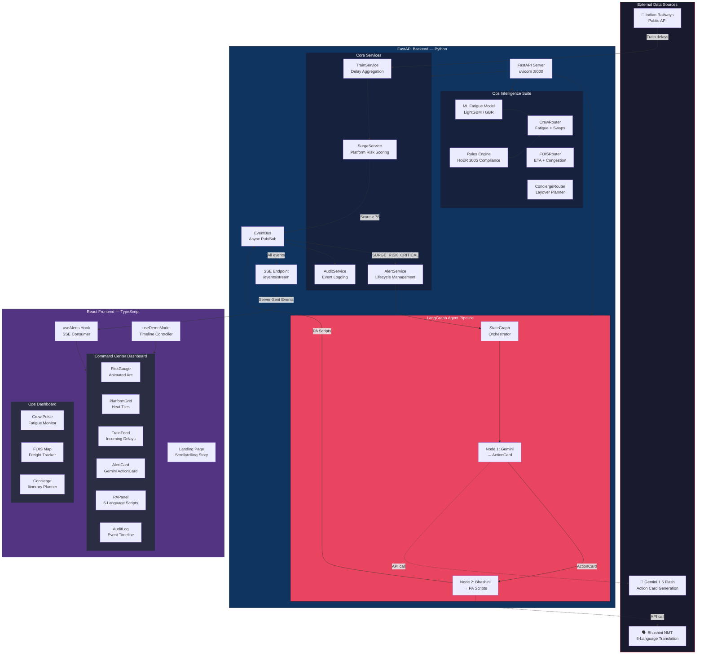
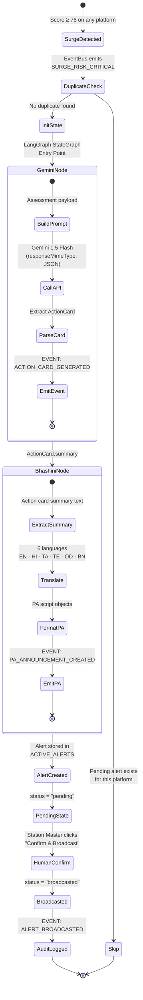
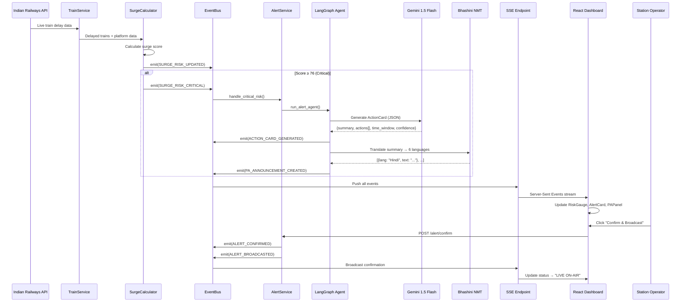

<](#)
[](#team)
[](#tech-stack)
[](#tech-stack)
[](#langgraph-agent-pipeline)
[](#ai-integration)
[](#license)

**Zenway predicts dangerous crowd surges at Indian railway stations up to 2 hours in advance — using only publicly available train delay data. No cameras. No sensors. No new hardware.**

[🎯 The Problem](#the-problem) · [💡 Our Solution](#our-solution) · [🏗️ Architecture](#system-architecture) · [🚀 Quick Start](#quick-start) · [📊 Demo](#judge-demo-mode) · [👥 Team](#team)

---

</div>

## 📑 Table of Contents

- [The Problem](#the-problem)
- [Our Solution](#our-solution)
- [Key Features](#key-features)
- [System Architecture](#system-architecture)
- [LangGraph Agent Pipeline](#langgraph-agent-pipeline)
- [End-to-End Event Flow](#end-to-end-event-flow)
- [Surge Score Algorithm](#surge-score-algorithm)
- [Feature Deep-Dives](#feature-deep-dives)
  - [Feature 1 — Crowd Surge Predictor](#feature-1--crowd-surge-predictor)
  - [Feature 2 — Ops & Crew Intelligence](#feature-2--ops--crew-intelligence)
  - [Feature 3 — Command Center Dashboard](#feature-3--command-center-dashboard)
- [Tech Stack](#tech-stack)
- [Project Structure](#project-structure)
- [Quick Start](#quick-start)
- [API Reference](#api-reference)
- [Judge Demo Mode](#judge-demo-mode)
- [Testing](#testing)
- [What Makes This Different](#what-makes-this-different)
- [Future Roadmap](#future-roadmap)
- [Team](#team)
- [License](#license)

---

## The Problem

On **February 15, 2025**, a stampede at New Delhi Railway Station killed **18 people** on the footbridge between platforms 14 and 15. Two Prayagraj-bound trains were delayed 30–45 minutes. Passengers accumulated across both platforms for nearly two hours with **zero crowd monitoring and zero early warning**. The Railway Board inquiry concluded:

> *"There was no early-warning mechanism. The crowd built up unnoticed."*

**Every existing crowd-management solution** — CCTV analytics, IoT sensors, manual headcounts — **reacts after a crowd has already formed**. By then it's too late. Zenway is different: it **predicts** the surge **before** it builds.

### The Insight

The Indian Railways public API already broadcasts real-time train delays. If two heavily-loaded trains are both running 45 minutes late to the same platform, the passenger load is easy to calculate:

```
predicted_load = base_passengers + (delayed_train_1_passengers + delayed_train_2_passengers)
surge_score    = min(100, (predicted_load / platform_capacity) × 100)
```

This is the data that was available **100 minutes before** the stampede. Zenway watches it continuously.

---

## Our Solution

**Zenway (StationSense)** is a full-stack AI platform that converts publicly available train delay data into life-saving, actionable crowd surge predictions. It combines:

1. **A deterministic surge scoring algorithm** that forecasts platform overcrowding 30–120 minutes in advance
2. **A LangGraph agent pipeline** that automatically generates AI-powered action cards (Gemini 1.5 Flash) and translates safety announcements into 6 Indian languages (Bhashini NMT)
3. **A real-time Command Center dashboard** with SSE-driven live telemetry, so station managers see risk climbing in real-time and can act with a single click
4. **An Ops Intelligence suite** for crew fatigue monitoring (ML-based), freight ETA prediction, and passenger layover concierge

---

## Key Features

| # | Feature | Description | Tech |
|---|---------|-------------|------|
| 🔴 | **Crowd Surge Predictor** | Platform-level risk scoring with explainable factor breakdown | Deterministic formula, EventBus |
| 🤖 | **Gemini Action Cards** | AI-generated dispatch recommendations for station masters | Gemini 1.5 Flash, LangGraph |
| 🗣️ | **Bhashini 6-Language PA** | Safety announcements in English, Hindi, Tamil, Telugu, Odia, Bengali | Bhashini NMT Pipeline |
| 👤 | **Human-in-the-Loop Gate** | Operator confirms before broadcast — no autonomous alerts | SSE + Confirm API |
| 📊 | **Live Command Center** | RiskGauge, PlatformGrid, TrainFeed, AlertCard, PAPanel, AuditLog | React 19, TypeScript, SSE |
| 🎬 | **Judge Demo Mode** | Compressed 60-second deterministic timeline (Normal → Critical) | Scripted JSON timelines |
| 👷 | **Crew Fatigue Monitor** | ML model (LightGBM/GBR) predicting loco-pilot fatigue scores | scikit-learn, joblib |
| 🚂 | **FOIS Freight Tracker** | ETA confidence bands + terminal congestion heatmaps | Deterministic hash model |
| 🗺️ | **Layover Concierge** | Geofenced itineraries for stranded passengers at 5 major stations | Time-boxed planner, i18n |

---

## System Architecture



---

## LangGraph Agent Pipeline

The alert generation system uses **LangGraph** (by LangChain) to orchestrate a stateful, multi-step AI pipeline with full traceability:



### Why LangGraph?

| Capability | Benefit |
|-----------|---------|
| **Stateful execution** | Each node reads/writes to a typed `AgentState` dictionary — full context flows through the pipeline |
| **Step tracing** | Every node logs `started_at`, `completed_at`, input/output — complete audit trail for regulators |
| **Compiled graph** | `workflow.compile()` produces an immutable, testable execution plan |
| **Async-native** | `ainvoke()` runs both API calls concurrently when possible |

---

## End-to-End Event Flow



---

## Surge Score Algorithm

The core prediction engine uses a **fully transparent, auditable formula** — no black-box ML for the safety-critical scoring path:

```python
# For each platform, every 60 seconds:

expected_passengers = sum(
    train.avg_passengers
    for train in delayed_trains
    if train.estimated_arrival within next 30 minutes
)

surge_score = min(100, ((typical_load + expected_passengers) / platform_capacity) × 100)

# Risk levels:
#   Normal   → score ≤ 50   (green)
#   Elevated → score 51-75  (amber)
#   Critical → score ≥ 76   (red) → triggers LangGraph pipeline
```

### Why Deterministic, Not ML?

| Decision | Rationale |
|----------|-----------|
| **Explainability** | Every score traces back to specific delayed trains, their passenger counts, and platform capacity — no "the model says so" |
| **Auditability** | Railway Board inquiries require deterministic, reproducible calculations |
| **Zero training data** | No historical crowd-crush dataset exists; synthetic ML would add false confidence |
| **Contributing factors** | Every API response includes the full factor breakdown for operator review |

---

## Feature Deep-Dives

### Feature 1 — Crowd Surge Predictor

The predictive engine that turns train delay data into platform-level crowd risk scores.

| Component | File | Purpose |
|-----------|------|---------|
| `SurgeCalculator` | `backend/surge.py` | Core formula: delayed train convergence → risk score |
| `SurgeService` | `backend/services/surge_service.py` | Orchestrator: fetches trains, delegates to calculator, emits events |
| `EventBus` | `backend/events/bus.py` | Async pub/sub backbone — decouples scoring from alerting |
| `RailwayAPI` | `backend/apis/railway_api.py` | Indian Railways data adapter with demo timeline support |
| Demo Scripts | `demo/normal.json`, `elevated.json`, `critical.json` | Scripted timelines for deterministic judge demos |

**7 Event Types** flow through the system:
`TRAIN_DELAY_DETECTED` → `SURGE_RISK_UPDATED` → `SURGE_RISK_CRITICAL` → `ACTION_CARD_GENERATED` → `PA_ANNOUNCEMENT_CREATED` → `ALERT_CONFIRMED` → `ALERT_BROADCASTED`

---

### Feature 2 — Ops & Crew Intelligence

A parallel intelligence suite for railway operations beyond crowd safety:

#### 🧠 Crew Fatigue Monitor

| Component | Description |
|-----------|-------------|
| **ML Model** | LightGBM / GradientBoosting regressor trained on synthetic shift data (5,000 samples) |
| **6 Input Features** | `shift_duration`, `consecutive_days`, `hours_since_rest`, `night_penalty`, `ambient_temp`, `route_complexity` |
| **Rules Engine** | Validates roster swaps against Hours of Employment Regulations 2005 (12h max continuous duty, 8h min rest, 60h weekly cap, 6-day max streak) |
| **Swap Orchestrator** | Auto-finds eligible replacements sorted by lowest fatigue score |

#### 🚂 FOIS Freight Intelligence

| Component | Description |
|-----------|-------------|
| **ETA Confidence Model** | Predicts freight rake arrival with 3-band confidence distribution (early/on-time/delayed) |
| **Terminal Congestion** | Monitors 5 major freight terminals (Mundra, JNPT, Visakhapatnam, Haldia, Chennai) with utilization alerts |
| **Interactive Map** | Leaflet-based real-time freight movement visualization |

#### 🗺️ Layover Concierge

| Component | Description |
|-----------|-------------|
| **Itinerary Generator** | Time-boxed, geofenced plans for passengers with 30 min–8 hr layovers |
| **5 Station Coverage** | New Delhi, Mumbai CST, Howrah, Chennai, Bengaluru — with real attractions, food, medical |
| **7-Language Support** | English, Hindi, Bengali, Tamil, Telugu, Marathi, Kannada |
| **Safety Guardrails** | 5 km geofence radius, mandatory return-buffer, medical facility inclusion |

---

### Feature 3 — Command Center Dashboard

A React 19 + TypeScript real-time operations interface:

| Component | Role |
|-----------|------|
| **RiskGauge** | Animated SVG arc gauge showing overall station risk with color transitions |
| **PlatformGrid** | Heat-mapped tile grid — each platform shows live score with Normal/Elevated/Critical coloring |
| **TrainFeed** | Real-time incoming train monitor with delay indicators and platform assignments |
| **AlertCard** | Gemini-generated action card with 5 specific dispatch recommendations |
| **PAPanel** | Bhashini-translated safety scripts in 6 languages with "LIVE ON-AIR" broadcast indicator |
| **AuditLog** | Full event timeline with color-coded entries for compliance review |
| **Navbar** | Station search with auto-suggestions, multi-tab station switching |

**Real-time data flow:** The `useAlerts` hook opens an `EventSource` SSE connection to `/events/stream`. Every backend event (surge update, alert generation, PA creation, broadcast confirmation) pushes to the dashboard instantly — no polling.

---

## Tech Stack

### Backend
| Technology | Version | Purpose |
|-----------|---------|---------|
| **Python** | 3.11+ | Core runtime |
| **FastAPI** | latest | Async REST API framework |
| **LangGraph** | latest | Stateful AI agent orchestration |
| **Pydantic** | v2 | Data validation & serialization |
| **HTTPX** | latest | Async HTTP client for Gemini API |
| **scikit-learn** | latest | Crew fatigue ML model (GBR fallback) |
| **LightGBM** | optional | Crew fatigue ML model (preferred) |
| **joblib** | latest | Model serialization |
| **Uvicorn** | latest | ASGI server |
| **pytest** | latest | Test framework |

### Frontend
| Technology | Version | Purpose |
|-----------|---------|---------|
| **React** | 19 | UI framework |
| **TypeScript** | 6.0 | Type safety |
| **Vite** | 8.0 | Build tool & dev server |
| **Tailwind CSS** | v4 | Utility-first styling |
| **Leaflet** | 1.9 | Interactive freight maps |
| **Lucide React** | latest | Icon library |
| **date-fns** | latest | Date formatting |

### External APIs
| Service | Purpose | Fallback |
|---------|---------|----------|
| **Gemini 1.5 Flash** | ActionCard generation (structured JSON output) | Cached responses + hardcoded defaults |
| **Bhashini NMT** | 6-language translation of PA scripts | Pre-cached translations per scenario |
| **Indian Railways API** | Live train delay data | Demo timeline scripts (`demo/*.json`) |

---

## Project Structure

```
Zenway/
├── backend/
│   ├── main.py                     # FastAPI app, routes, SSE endpoint
│   ├── agent.py                    # LangGraph StateGraph (Gemini → Bhashini)
│   ├── surge.py                    # Surge score calculator (core formula)
│   ├── config.py                   # Environment settings (Pydantic)
│   ├── constants.py                # Risk thresholds (50/75/76)
│   ├── requirements.txt            # Python dependencies
│   │
│   ├── apis/
│   │   ├── gemini_client.py        # Gemini 1.5 Flash integration
│   │   ├── bhashini_client.py      # Bhashini NMT translation
│   │   ├── railway_api.py          # Indian Railways data adapter
│   │   └── ntes_api.py             # NTES fallback client
│   │
│   ├── models/
│   │   ├── surge.py                # Platform, Station, CrowdRiskAssessment
│   │   ├── train.py                # Train schema
│   │   ├── alert.py                # Alert, ActionCard, Announcement, AgentRun
│   │   └── audit_log.py            # AuditLogEntry schema
│   │
│   ├── services/
│   │   ├── surge_service.py        # Surge orchestration & demo timeline
│   │   ├── train_service.py        # Train data aggregation
│   │   ├── alert_service.py        # Alert lifecycle + CRITICAL event handler
│   │   └── audit_service.py        # Event history persistence
│   │
│   ├── events/
│   │   ├── bus.py                  # Async EventBus (pub/sub)
│   │   └── event_types.py          # 7 event type constants
│   │
│   ├── feature2/
│   │   ├── ml_fatigue_model.py     # LightGBM/GBR fatigue predictor
│   │   ├── fatigue_model.joblib    # Trained model artifact
│   │   ├── rules_engine.py         # HoER 2005 compliance validator
│   │   ├── agent_rescheduler.py    # Crew swap orchestrator
│   │   ├── fois_eta_brain.py       # Freight ETA + terminal congestion
│   │   ├── concierge_service.py    # Layover itinerary generator
│   │   ├── router_crew.py          # /api/v1/crew/* endpoints
│   │   ├── router_fois.py          # /api/v1/fois/* endpoints
│   │   └── router_concierge.py     # /api/v1/concierge/* endpoints
│   │
│   ├── data/
│   │   ├── stations.json           # 3 stations: NDLS, HWH, CSMT
│   │   ├── howrah_seed_trains.json # Seed data for Howrah
│   │   ├── cached_api_responses.json # Cached Gemini/Bhashini responses
│   │   └── audit_log.json          # Persistent audit trail
│   │
│   └── tests/
│       ├── test_surge.py           # Surge formula unit tests
│       └── test_agent_run.py       # LangGraph pipeline integration test
│
├── frontend/
│   ├── src/
│   │   ├── App.tsx                 # Root router (/, /dashboard, /ops-dashboard)
│   │   ├── main.tsx                # React entry point
│   │   │
│   │   ├── pages/
│   │   │   ├── Landing.tsx         # Scrollytelling landing page
│   │   │   ├── Dashboard.tsx       # Command Center (6 components)
│   │   │   └── OpsDashboard.tsx    # Ops Intelligence (3 tabs)
│   │   │
│   │   ├── components/
│   │   │   ├── RiskGauge.tsx       # Animated SVG risk arc
│   │   │   ├── PlatformGrid.tsx    # Heat-mapped platform tiles
│   │   │   ├── TrainFeed.tsx       # Incoming train monitor
│   │   │   ├── AlertCard.tsx       # Gemini action card display
│   │   │   ├── PAPanel.tsx         # 6-language PA scripts
│   │   │   ├── AuditLog.tsx        # Event timeline
│   │   │   ├── Navbar.tsx          # Search + station tabs
│   │   │   ├── SXLogo.tsx          # Custom SVG brand mark
│   │   │   └── feature2/
│   │   │       ├── CrewPulseDashboard.tsx
│   │   │       ├── FoisEtaTracker.tsx
│   │   │       ├── InteractiveFoisMap.tsx
│   │   │       ├── LayoverConcierge.tsx
│   │   │       ├── CrewGanttChart.tsx
│   │   │       ├── RosterSwapModal.tsx
│   │   │       └── ItineraryTimelineItem.tsx
│   │   │
│   │   ├── hooks/
│   │   │   ├── useAlerts.ts        # SSE consumer + alert state machine
│   │   │   ├── useDemoMode.ts      # Demo timeline controller
│   │   │   └── useSurgeScore.ts    # Polling surge scores
│   │   │
│   │   ├── services/
│   │   │   └── api.ts              # API client (Feature 1 + Feature 2)
│   │   │
│   │   ├── types/                  # TypeScript interfaces
│   │   ├── context/                # React GlobalContext
│   │   └── lib/stationsense/       # Custom animations & illustrations
│   │
│   ├── package.json
│   ├── vite.config.ts
│   └── tsconfig.json
│
├── demo/
│   ├── normal.json                 # Low-risk scenario script
│   ├── elevated.json               # Medium-risk scenario script
│   └── critical.json               # Feb 15 replay scenario script
│
├── docs/
│   ├── architecture.md
│   ├── api-reference.md
│   ├── demo-script.md
│   ├── deployment.md
│   └── judging-story.md
│
├── .env                            # API keys (GEMINI_API_KEY, BHASHINI_API_KEY)
├── .gitignore
├── LICENSE                         # MIT
└── README.md                       # ← You are here
```

---

## Quick Start

### Prerequisites

- Python 3.11+ with `pip`
- Node.js 18+ with `npm`
- (Optional) Gemini API key for live action cards

### 1. Clone & Configure

```bash
git clone https://github.com/MASONS/Zenway.git
cd Zenway

# Create .env file with your API keys (optional — system works without them)
echo "GEMINI_API_KEY=your_key_here" > .env
echo "BHASHINI_API_KEY=your_key_here" >> .env
```

### 2. Start Backend

```bash
# Create virtual environment
python -m venv venv

# Activate (Windows)
.\venv\Scripts\activate

# Activate (macOS/Linux)
source venv/bin/activate

# Install dependencies
pip install -r backend/requirements.txt

# Launch server
uvicorn backend.main:app --reload --port 8000
```

> Backend runs at **http://localhost:8000** · API docs at **http://localhost:8000/docs**

### 3. Start Frontend

```bash
cd frontend
npm install
npm run dev
```

> Frontend runs at **http://localhost:5173**

### 4. Run the Demo

1. Open **http://localhost:5173** → Explore the landing page story
2. Click **"Open Dashboard"** → Search for "New Delhi" and enter the station
3. Select **"Critical"** from the Demo Mode selector → Watch risk scores climb
4. When the AlertCard appears → Click **"Confirm & Broadcast"**
5. See PA Panel show **6-language safety announcements** marked "LIVE ON-AIR"
6. Check the Audit Log for the complete event trail
7. Navigate to **"Ops Dashboard"** to explore Crew Pulse, FOIS, and Concierge

---

## API Reference

### Core Endpoints (Feature 1 + 3)

| Method | Endpoint | Description |
|--------|----------|-------------|
| `GET` | `/` | Health check & system status |
| `GET` | `/surge-score?station=NDLS&platform=P1` | Single platform surge assessment |
| `GET` | `/surge-score/all?station=NDLS` | All platforms for a station |
| `GET` | `/trains/incoming?station=NDLS` | Incoming trains with delay data |
| `POST` | `/alert/generate` | Manually trigger LangGraph pipeline |
| `POST` | `/alert/announce` | Generate Bhashini translations |
| `POST` | `/alert/confirm` | Human-in-the-loop broadcast gate |
| `GET` | `/events/history` | Audit log history |
| `GET` | `/events/stream` | SSE real-time event stream |
| `POST` | `/demo/reset?scenario=critical` | Reset demo timeline state |

### Ops Intelligence Endpoints (Feature 2)

| Method | Endpoint | Description |
|--------|----------|-------------|
| `GET` | `/api/v1/crew/roster` | Active crew roster with fatigue scores |
| `GET` | `/api/v1/crew/roster/alerts` | Fatigued crew alerts above threshold |
| `POST` | `/api/v1/crew/roster/swap` | Request duty swap with rules validation |
| `GET` | `/api/v1/fois/rakes` | All tracked freight rakes |
| `POST` | `/api/v1/fois/eta/batch` | Batch ETA predictions with confidence bands |
| `GET` | `/api/v1/fois/congestion` | All terminal congestion snapshots |
| `GET` | `/api/v1/fois/congestion/{terminal}` | Single terminal congestion |
| `GET` | `/api/v1/concierge/stations` | Supported layover stations |
| `GET` | `/api/v1/concierge/languages` | Available translation languages |
| `POST` | `/api/v1/concierge/itinerary` | Generate geofenced layover itinerary |

---

## Judge Demo Mode

Zenway includes a **100% deterministic, offline-capable** demo mode designed for live judging. Three pre-scripted timelines compress real-world scenarios into 60-second replays:

| Scenario | What Happens | Risk Arc |
|----------|-------------|----------|
| **Normal** | Routine evening at NDLS. Minor delays, all platforms green. | 25 → 35 → 25 |
| **Elevated** | Two trains delayed 30 min to same platform. Amber warning. | 35 → 55 → 72 |
| **Critical** | Feb 15 replay. Compound delays, platform scores hit 100. LangGraph triggers. | 35 → 72 → 100 🔴 |

### Critical Scenario Timeline

```
0s   → Normal load (score 35) — "Quiet evening at NDLS"
12s  → Elevated (score 55) — "Prayagraj Express delayed +45 min"
24s  → Critical (score 85) — "Second train delayed to same platform"
36s  → SURGE_RISK_CRITICAL fired → LangGraph agent starts
       → Gemini ActionCard generated (5 dispatch actions)
       → Bhashini PA in 6 languages
       → AlertCard appears on dashboard
48s  → Operator clicks "Confirm & Broadcast"
       → PA Panel shows "LIVE ON-AIR"
       → AuditLog records: ALERT_BROADCASTED
60s  → Timeline auto-loops (or reset via POST /demo/reset)
```

> **No API keys required.** All Gemini and Bhashini responses are pre-cached in `backend/data/cached_api_responses.json`. The demo runs fully offline with pixel-perfect fidelity.

---

## Testing

```bash
# Activate virtual environment
.\venv\Scripts\activate

# Run all backend tests (3/3 should pass)
python -m pytest backend/tests/ -v

# Expected output:
# test_surge.py::test_normal_platform_score     PASSED
# test_surge.py::test_critical_platform_score   PASSED
# test_agent_run.py::test_agent_run_pipeline     PASSED
```

### What's Tested

| Test | Validates |
|------|-----------|
| `test_normal_platform_score` | Surge formula returns Normal (≤50) when no trains are delayed |
| `test_critical_platform_score` | Surge formula returns Critical (≥76) when delayed trains converge |
| `test_agent_run_pipeline` | Full LangGraph execution: Gemini → Bhashini → Alert creation |

---

## What Makes This Different

| Approach | Every Other Solution | Zenway |
|----------|---------------------|--------|
| **Detection** | Reactive (cameras, sensors) — sees crowds **after** they form | **Predictive** — forecasts crowds **before** they build |
| **Data source** | Requires new hardware (CCTV, IoT, LiDAR) | **Zero hardware** — uses existing public railway API |
| **Lead time** | Minutes (if any) | **Up to 120 minutes** advance warning |
| **Explainability** | "AI confidence: 87%" | Full factor breakdown: *which trains, how many passengers, which platform, what capacity* |
| **Cost to deploy** | ₹10-50 Cr per station (cameras + compute) | **₹0 hardware cost** — runs on a single server |
| **Coverage** | Pilot stations only | **7,330+ stations** covered by public API from day 1 |
| **Language** | English alerts only | **6 Indian languages** via Bhashini (Hindi, Tamil, Telugu, Odia, Bengali) |
| **Human oversight** | Autonomous or none | **Human-in-the-loop** confirmation gate before every broadcast |

---

## Future Roadmap

| Phase | Capability | Timeline |
|-------|-----------|----------|
| **v1.1** | Integration with official NTES real-time API for live delay feeds | Q3 2026 |
| **v1.2** | Mobile app for platform-level RPF / station manager push notifications | Q4 2026 |
| **v2.0** | Historical delay pattern ML model for long-range (24h) crowd forecasting | Q1 2027 |
| **v2.1** | Bhashini TTS audio generation for automated PA system broadcast | Q1 2027 |
| **v2.2** | Multi-station cascade analysis (how delays at one station affect others) | Q2 2027 |
| **v3.0** | Integration with Indian Railways CRIS infrastructure for official deployment | 2027+ |

---

## Team

<div align="center">

### 🏛️ **Team MASONS**

**FAR AWAY 2026 — Round 1**

*Building systems that save lives with the data that already exists.*

</div>

---

## License

This project is licensed under the **MIT License** — see the [LICENSE](LICENSE) file for details.

---

<div align="center">

**Built with urgency. Because the next crowd surge is preventable.**

*StationSense — Predict. Alert. Protect.*

🚆

</div>
]]>
