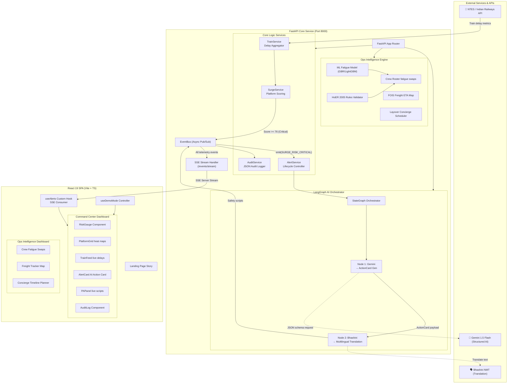
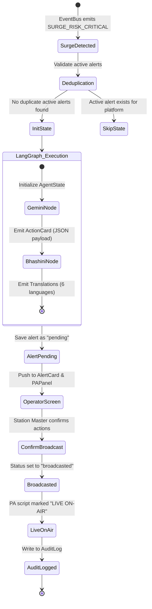

# 🚆 Zenway — StationSense

### **AI-Powered Crowd Surge Prevention & Railway Operations Intelligence**

> **"18 people died on Platforms 14 & 15. The data to predict it existed 100 minutes earlier. No system was watching."**
> — *New Delhi Railway Station Incident, February 15, 2025*

---

[](#)
[](#)
[](#)
[](#)
[](#)
[](#)

Zenway is a real-time predictive crowd management and operations intelligence platform designed for Indian Railways. By converting publicly available train schedule and delay data into high-resolution, platform-level crowd density projections, **Zenway predicts hazardous crowd surges up to 2 hours in advance—requiring zero hardware sensors, cameras, or local infrastructure.**

### Key Navigation
[🎯 The Problem](#-the-problem) | [💡 The Solution](#-the-solution) | [🏗️ System Architecture](#-system-architecture) | [🤖 LangGraph Pipeline](#-langgraph-agent-pipeline) | [📊 Features](#-features) | [🚀 Quick Start](#-quick-start) | [🎬 Judge Demo Guide](#-judge-demo-mode)

---

## 🎯 The Problem

Traditional crowd management systems are reactive: they rely on CCTV video analytics, IoT density sensors, or manual security patrol reports to detect overcrowding **after** it has already formed. In high-throughput settings like Indian railway stations, a sudden influx of delayed trains can cause fatal crowd surges on platforms and footbridges within minutes. 

On February 15, 2025, a stampede at New Delhi Railway Station occurred due to the convergence of delayed trains. The delay data was available on public APIs nearly 100 minutes before the crowd peaked, yet station operators had no predictive tools to forecast the bottleneck on Platforms 14 & 15.

---

## 💡 The Solution

Zenway shifts the paradigm from reactive detection to **predictive prevention**.

1. **Deterministic Crowd Surge Calculator**: Leverages real-time NTES/IR API train delay updates and average passenger statistics to forecast passenger accumulation on specific platforms.
2. **LangGraph Orchestrated AI Pipeline**: Instantly triggers on critical risk alerts to generate platform-specific crowd mitigation checklists (Gemini 1.5 Flash) and translate safety announcements into 6 local languages (Bhashini NMT).
3. **Human-in-the-Loop Command Center**: A real-time telemetry dashboard (React 19 + SSE) that enables station masters to monitor risk levels and dispatch audio announcements to the PA system with a single click.
4. **Operations & Crew Intelligence Suite**: Extends platform capabilities to include crew fatigue regression modeling, FOIS freight tracking with terminal utilization maps, and passenger layover concierge routing.

---

## 🏗️ System Architecture

Zenway is built using a decoupled, async-first architecture. The backend (FastAPI) handles data ingestion, scoring, and AI agent execution. The frontend (React 19) consumes real-time telemetry via a persistent Server-Sent Events (SSE) stream.



---

## 🤖 LangGraph Agent Pipeline

Safety-critical operations require explainable execution paths. The alert pipeline uses a **LangGraph StateGraph** to manage multi-step generation, tracing inputs, outputs, and timestamps at each step.



### LangGraph Implementation Details
- **Typed AgentState**: The shared pipeline memory keeps schemas strongly typed, preventing API boundary failures between nodes.
- **Granular Tracing**: Each node captures `started_at` and `completed_at` to guarantee fully auditable, step-by-step latency tracking.
- **Resilient Fallbacks**: If external API timeouts occur, nodes automatically fall back to cached templates to keep the command center operational.

---

## 📐 Surge Score Algorithm

Zenway relies on a **deterministic mathematical formula** for crowd safety calculations to guarantee absolute audibility and avoid black-box ML decision errors.

```python
# For each platform, updated on a 60-second polling interval:

expected_passengers = sum(
    train.avg_passengers
    for train in delayed_trains
    if train.estimated_arrival_minutes <= 30
)

surge_score = min(100, ((typical_load + expected_passengers) / platform_capacity) * 100)

# Risk Thresholding:
#   Normal   (Green)  => Score <= 50
#   Elevated (Amber)  => Score 51 - 75
#   Critical (Red)    => Score >= 76  --> Triggers LangGraph Agent
```

---

## 📊 Features

### 1. Crowd Surge Predictor & Command Center (Features 1 & 3)
- **RiskGauge**: Real-time visualization of overall station load with animated SVG gauge transitions.
- **PlatformGrid**: Heatmap representing platform status. Instantly highlights critical capacity issues.
- **TrainFeed**: Monitor delay lists and assigned platforms.
- **AlertCard (Human-in-the-Loop)**: When capacity hits the critical threshold, Gemini 1.5 Flash automatically generates a structured action card with 5 targeted operational instructions (e.g., dispatch RPF, deploy platform barriers).
- **PAPanel**: Displays Bhashini NMT-translated audio announcement scripts in 6 regional languages (English, Hindi, Tamil, Telugu, Odia, Bengali). Station managers can edit and confirm the script before broadcast.

### 2. Operational Intelligence (Feature 2)
- **Crew Fatigue Monitor**: Trains a Gradient Boosting Regressor (GBR) / LightGBM model to predict loco-pilot fatigue based on shift parameters (duration, night penalty, route complexity).
- **Roster Rescheduling**: Performs automated roster swaps when fatigue crosses safety limits, validating against the **Hours of Employment Regulations 2005 (HoER)** (12-hour duty limits, minimum rest periods, 60-hour weekly cap).
- **FOIS Freight Tracker**: Predicts freight arrival confidence bands (early/on-time/late) and visualizes yard utilization heatmaps for terminal managers.
- **Layover Concierge**: Auto-generates geofenced itineraries for passengers delayed at major terminals, incorporating travel buffers and local medical contact options.

---

## 📂 Project Structure

```
Zenway/
├── backend/
│   ├── main.py                     # FastAPI server app & routes
│   ├── agent.py                    # LangGraph StateGraph pipeline definition
│   ├── surge.py                    # Surge score deterministic calculator
│   ├── config.py                   # Pydantic base settings and environment loaders
│   ├── constants.py                # Platform risk threshold levels
│   ├── requirements.txt            # Python backend dependencies
│   │
│   ├── apis/
│   │   ├── gemini_client.py        # Gemini 1.5 Flash client (ActionCard payload)
│   │   ├── bhashini_client.py      # Bhashini NMT multilingual client
│   │   └── railway_api.py          # NTES mock data adapter for demo timelines
│   │
│   ├── models/                     # Pydantic data schemas
│   │   ├── surge.py                # Platform & Station models
│   │   ├── train.py                # Train detail schemas
│   │   └── alert.py                # ActionCard & Announcement models
│   │
│   ├── services/                   # Business logic layers
│   │   ├── surge_service.py        # Logic orchestrator & timeline driver
│   │   ├── alert_service.py        # Lifecycle management for safety alerts
│   │   └── audit_service.py        # Event history persistency layer
│   │
│   ├── feature2/                   # Operational Intelligence features
│   │   ├── ml_fatigue_model.py     # GBR loco-pilot fatigue predictor training
│   │   ├── rules_engine.py         # HoER 2005 labor compliance rules
│   │   ├── agent_rescheduler.py    # Crew roster smart swap engine
│   │   ├── fois_eta_brain.py       # Freight ETA & yard utilization analytics
│   │   └── concierge_service.py    # Time-boxed layover itinerary builder
│   │
│   └── tests/
│       ├── test_surge.py           # Unit tests for surge math
│       └── test_agent_run.py       # Integration tests for LangGraph nodes
│
├── frontend/
│   ├── src/
│   │   ├── App.tsx                 # Client routing engine (/, /dashboard, /ops-dashboard)
│   │   ├── pages/
│   │   │   ├── Landing.tsx         # Scrollytelling interactive narrative
│   │   │   ├── Dashboard.tsx       # Command Center container
│   │   │   └── OpsDashboard.tsx    # Operational Intelligence dashboard
│   │   │
│   │   ├── components/             # Subcomponents
│   │   │   ├── RiskGauge.tsx       # Overall risk gauge component
│   │   │   ├── PlatformGrid.tsx    # Platform heatmap matrix
│   │   │   ├── AlertCard.tsx       # AI task card dispatch UI
│   │   │   ├── PAPanel.tsx         # Multilingual broadcast component
│   │   │   ├── AuditLog.tsx        # Event timeline visualizer
│   │   │   └── feature2/           # Feature 2 components
│   │   │       ├── CrewPulseDashboard.tsx
│   │   │       ├── InteractiveFoisMap.tsx
│   │   │       └── LayoverConcierge.tsx
│   │   │
│   │   ├── hooks/
│   │   │   ├── useAlerts.ts        # EventSource SSE connector state machine
│   │   │   └── useDemoMode.ts      # Active timeline trigger hook
│   │   └── services/
│   │       └── api.ts              # Axios api connector client
│   │
│   └── package.json
│
├── demo/                           # Scripted timelines for live judging
│   ├── normal.json                 # Standard traffic timeline
│   ├── elevated.json               # Heightened delay timeline
│   └── critical.json               # Replay of New Delhi platform convergence
```

---

## 🚀 Quick Start

### 1. Prerequisites
- Python 3.11+
- Node.js 18+ (with npm)
- Gemini API Key (optional - system falls back to cached responses)

### 2. Installation & Configuration
Clone the repository:
```bash
git clone https://github.com/MASONS/Zenway.git
cd Zenway
```

Create a `.env` file in the root directory:
```env
GEMINI_API_KEY=your_gemini_api_key_here
BHASHINI_API_KEY=your_bhashini_api_key_here
```

### 3. Start the Backend Server
```bash
# Setup Python virtual environment
python -m venv venv
source venv/bin/activate    # On Windows: .\venv\Scripts\activate

# Install requirements
pip install -r backend/requirements.txt

# Start backend using Uvicorn
uvicorn backend.main:app --reload --port 8000
```
- API Docs: [http://localhost:8000/docs](http://localhost:8000/docs)
- SSE Live Stream: [http://localhost:8000/events/stream](http://localhost:8000/events/stream)

### 4. Start the Frontend Dev Server
```bash
cd frontend
npm install
npm run dev
```
- Frontend Access: [http://localhost:5173](http://localhost:5173)

---

## 🎬 Judge Demo Guide

Zenway includes an offline-first **Judge Demo Mode** that compresses a real-world 100-minute platform crowd build-up into a 60-second deterministic scenario.

| Scenario | Risk Curve Profile | Description |
|---|---|---|
| **Normal** | 25% → 35% → 25% | Routine operations at NDLS. Normal passenger flow. |
| **Elevated** | 35% → 55% → 72% | Delayed train arrivals on Platform 2. Risk level enters Amber. |
| **Critical** | 35% → 72% → 100% 🔴 | Simulation of New Delhi convergence. platform score hits 100%. |

### Critical Timeline Walkthrough (60 Seconds)
1. **0s - 12s (Normal)**: Station risk score sits green at 35%. Incoming feeds display routine schedules.
2. **12s - 24s (Elevated)**: Delay notification triggers for the Prayagraj Express. Risk index climbs to 72% (Amber).
3. **24s - 36s (Critical)**: Second delayed train routed to the same platform. Platform score spikes to 100% (Red).
4. **36s - 48s (Agent Trigger)**: LangGraph automatically executes:
   - **Gemini 1.5 Flash** compiles custom 5-point Action Card.
   - **Bhashini NMT** generates translated safety scripts (6 languages).
   - Telemetry triggers AlertCard & PAPanel on the client dashboard.
5. **48s - 60s (Human-in-the-Loop)**: Operator reviews translations, edits instructions if needed, and clicks **"Confirm & Broadcast"**. 
   - PA Script status shifts to **LIVE ON-AIR**.
   - AuditLog records the exact timestamp of dispatch for post-incident reviews.

---

## 🧪 Testing

The backend includes comprehensive test suites covering the core predictive surge calculator and the multi-node LangGraph pipeline.

```bash
# Run pytest in the virtual environment
python -m pytest backend/tests/ -v
```

---

## 👥 Team

Built with 🧡 by **Team MASONS** for **FAR AWAY 2026** (Round 1).

- **Team Members**: MASONS Developers
- **Mission**: Leveraging existing infrastructure data to design preventative safety systems.

---

## 📜 License

Distributed under the MIT License. See [LICENSE](LICENSE) for more information.
