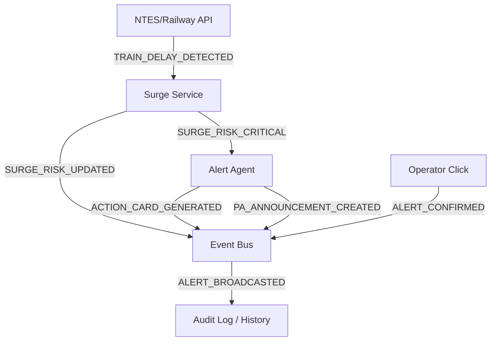

# System Architecture — Zenway (RailMind Sentinel)

Zenway is a real-time crowd surge prediction and multilingual alert system for Indian Railways. It is built to predict surges before they occur, translate alerts into regional languages, and provide a dashboard for station masters to take action.

---

## 1. Product & Architecture Principles

Zenway adheres to six strict product principles:
1. **Demo Reliability > Technical Complexity:** The system incorporates a 100% deterministic Judge Demo Mode that works without active internet connections or third-party API keys using pre-recorded mock files.
2. **Explainability > Black Box AI:** The surge score calculations are pure math, displaying exact formula steps and contributing factors directly on the dashboard.
3. **Human In Control:** AI does not make active decisions (like announcing alerts). Station masters must review and manually confirm safety mitigations.
4. **Railway Operator First:** The user interface displays concrete, actionable steps ("What should the station master do next?").
5. **Zero Fake AI:** Gemini is used solely for text recommendation and script synthesis—never for core safety risk math.
6. **Fast Recovery:** If external network integrations (Bhashini, Gemini, Indian Rail) fail, Zenway automatically degrades using cached assets.

---

## 2. Event-Driven Architecture (Pub/Sub)

Zenway uses a decoupled event-driven model. Subsystems interact asynchronously by publishing and subscribing to core events. This provides clear extensibility for future Kafka/Redis queues.

### Core Events
- **`TRAIN_DELAY_DETECTED`**: Emitted when a train's delay status is updated.
- **`SURGE_RISK_UPDATED`**: Recalculates platform scores and updates telemetry.
- **`SURGE_RISK_CRITICAL`**: Triggered when a platform score crosses 76+.
- **`ACTION_CARD_GENERATED`**: Fired when Gemini returns the ActionCard.
- **`PA_ANNOUNCEMENT_CREATED`**: Fired when Bhashini completes translations.
- **`ALERT_CONFIRMED`**: Emitted upon operator's approval.
- **`ALERT_BROADCASTED`**: Final state triggering PA speech synthesis and RPF dispatch.

---

## 3. Core Score Mathematical Formula
$$expected\_passengers\_from\_delayed\_trains = delayed\_trains\_arriving\_in\_30min \times avg\_passengers\_per\_train$$
$$expected\_load = typical\_load + expected\_passengers\_from\_delayed\_trains$$
$$score = \min\left(100, \left(\frac{expected\_load}{platform\_capacity}\right) \times 100\right)$$

- **Normal Threshold (0-50):** Typical platform operations.
- **Elevated Threshold (51-75):** Risk of congestion, operators alerted.
- **Critical Threshold (76-100):** Stampede threat, triggers LangGraph mitigation agent.
